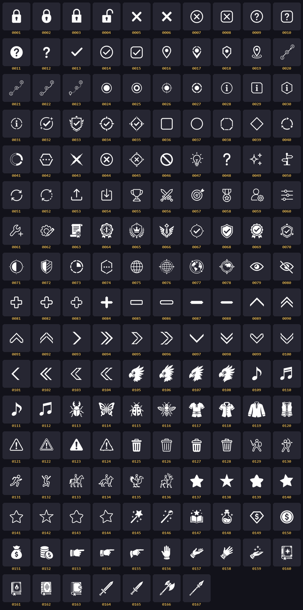

# PanacheUI Icon Set

167 flat white-on-transparent glyphs, 313×313 RGBA, shipped in [`Icons/`](Icons/) as
zero-padded 4-digit PNGs (`0001.png` … `0167.png`).

```csharp
PUI.Icon(36, 16f, tint: accent)     // decorative by default — PointerEvents.None, no Id
PUI.Icon(36, 16f, nodeId: "row-mark", interactive: true)
```

---

## Contact sheet



Regenerate after adding icons:

```bash
python - <<'PY'
from PIL import Image, ImageDraw, ImageFont
import glob, os, math
fs = sorted(glob.glob('Icons/*.png'))
CELL, PAD, LBL, COLS = 88, 8, 18, 10
font = ImageFont.truetype('C:/Windows/Fonts/consolab.ttf', 13)
rows = math.ceil(len(fs) / COLS)
sh = Image.new('RGB', (COLS*(CELL+PAD)+PAD, rows*(CELL+LBL+PAD)+PAD), (18, 18, 26))
d = ImageDraw.Draw(sh)
for i, f in enumerate(fs):
    cx = PAD + (i % COLS)*(CELL+PAD); cy = PAD + (i // COLS)*(CELL+LBL+PAD)
    d.rounded_rectangle([cx, cy, cx+CELL, cy+CELL], radius=6, fill=(38, 38, 50))
    im = Image.open(f).convert('RGBA').resize((CELL-22, CELL-22), Image.LANCZOS)
    sh.paste(im, (cx+11, cy+11), im)
    d.text((cx+CELL//2, cy+CELL+2), os.path.basename(f)[:4], fill=(224, 178, 76), font=font, anchor='ma')
sh.save('docs/icons/contact-sheet.png')
PY
```

---

## About the names

**The ID is the address. The name is a label for humans and agents reading this file.**

`PanacheIcons.Get` takes an ID and nothing else, the icon browser shows IDs, and every
call site in every plugin passes an ID. There is no name-based lookup and none is planned
— names drift, IDs don't. The names below exist so that nobody has to build their own
labelled montage to answer "which number is the info circle", which is the exact tax this
file was written to remove.

Names are unique across the set, so near-identical variants (`0005`/`0006`, `0012`/`0048`,
`0034`/`0067`) are distinguished by their differing detail rather than being collapsed
into one name.

Where a family is the *same subject drawn several ways* — four chocobo heads, four stars,
four bin lids — the members are numbered (`star-solid-1` … `star-solid-4`) rather than
given four strained adjectives. The **Glyph** column still records what actually separates
them, so the number is a handle and the column is the description.

Every name below was assigned by looking at the rendered glyph, not inferred from
filename order. Two prior verbal descriptions turned out to be wrong on inspection and are
corrected here: **`0028` is an info circle** (not a question mark) and **`0030` is an info
hexagon** (not an empty box).

---

## Status / locks — 0001–0015

| ID | Name | Glyph |
|----|------|-------|
| 0001 | `lock-closed` | Padlock, closed, tall body |
| 0002 | `lock-closed-rounded` | Padlock, closed, rounded body |
| 0003 | `lock-closed-wide` | Padlock, closed, wide squat body |
| 0004 | `lock-open` | Padlock with the shackle swung open |
| 0005 | `x-mark-heavy` | Bare X, heavy stroke |
| 0006 | `x-mark-light` | Bare X, thin stroke |
| 0007 | `x-circle` | X inside a circle outline |
| 0008 | `x-square` | X inside a rounded-square outline |
| 0009 | `question-circle` | ? inside a circle outline |
| 0010 | `question-square` | ? inside a rounded-square outline |
| 0011 | `question-circle-filled` | ? knocked out of a solid circle |
| 0012 | `question-mark-heavy` | Bare ?, heavy stroke |
| 0013 | `check-mark` | Bare checkmark |
| 0014 | `check-circle` | Check inside a circle outline |
| 0015 | `check-square` | Check inside a rounded-square outline |

## Map pins & routes — 0016–0023

| ID | Name | Glyph |
|----|------|-------|
| 0016 | `pin-map` | Teardrop map pin, hollow centre |
| 0017 | `pin-map-split` | Map pin with a gap in the top of the ring |
| 0018 | `pin-shield` | Pentagon/shield-shaped marker with a centre dot |
| 0019 | `pin-map-grounded` | Map pin over an ellipse "ground shadow" |
| 0020 | `route-solid` | Waypoints 1→2→3 joined by a solid line, arrowhead |
| 0021 | `route-dotted` | Waypoints 1→2→3 joined by a dotted line |
| 0022 | `route-curved` | Waypoints 1→2→3 on a smooth curve |
| 0023 | `route-from-pin` | Dotted route starting at a map pin |

## Targets & info — 0024–0031

| ID | Name | Glyph |
|----|------|-------|
| 0024 | `dot-ring-heavy` | Filled dot inside a thick ring |
| 0025 | `dot-ring-concentric` | Filled dot inside two thin rings |
| 0026 | `crosshair-dot` | Dot in a ring with four crosshair ticks |
| 0027 | `target-ring-dashed` | Dot inside a dashed/segmented ring |
| 0028 | `info-circle` | i inside a circle outline |
| 0029 | `info-square-clipped` | i inside a square with one clipped corner |
| 0030 | `info-hexagon` | i inside a hexagon outline |
| 0031 | `info-circle-dashed` | i inside a segmented circle |

## Verified / achievement marks — 0032–0035

| ID | Name | Glyph |
|----|------|-------|
| 0032 | `check-circle-sparkle` | Check in a broken circle with sparkles |
| 0033 | `check-shield-winged` | Check on a shield with wing flourishes |
| 0034 | `check-circle-compass-rose` | Check in a ring with four leaf-shaped points |
| 0035 | `check-diamond` | Check inside a diamond with arrow points |

## Bare shapes — 0036–0042

| ID | Name | Glyph |
|----|------|-------|
| 0036 | `square-outline` | Empty rounded square |
| 0037 | `circle-outline` | Empty circle |
| 0038 | `octagon-dashed` | Empty octagon, dashed edges |
| 0039 | `diamond-outline` | Empty diamond |
| 0040 | `arrows-circular-dashed` | Two chasing arrows on a dashed circle |
| 0041 | `ring-progress-partial` | Donut ring with a quadrant missing |
| 0042 | `hexagon-ellipsis` | Three dots inside a solid-edged hexagon |

## Negative / alert — 0043–0048

| ID | Name | Glyph |
|----|------|-------|
| 0043 | `x-blades` | X with tapered, blade-like points |
| 0044 | `x-circle-heavy` | X inside a circle, heavy stroke |
| 0045 | `x-diamond-arrows` | X in a diamond with four outward arrows |
| 0046 | `prohibited` | Circle with a diagonal bar (no-entry) |
| 0047 | `lightbulb-idea` | Lightbulb with radiating lines |
| 0048 | `question-mark-light` | Bare ?, lighter stroke than 0012 |

## Actions & navigation — 0049–0054

| ID | Name | Glyph |
|----|------|-------|
| 0049 | `sparkles` | Three four-point sparkles |
| 0050 | `signpost` | Directional signpost on a stake |
| 0051 | `refresh-loop` | Two arrows forming a closed loop |
| 0052 | `refresh-dashed` | Refresh loop with a dashed segment |
| 0053 | `upload-tray` | Up arrow out of an open tray |
| 0054 | `download-tray` | Down arrow into a closed tray |

## Rewards & tools — 0055–0064

| ID | Name | Glyph |
|----|------|-------|
| 0055 | `trophy` | Two-handled trophy cup on a plinth |
| 0056 | `swords-crossed` | Two crossed swords |
| 0057 | `target-arrow` | Dartboard with an arrow in the bullseye |
| 0058 | `medal-star` | Star medal on a ribbon bar |
| 0059 | `user-settings` | Person silhouette with a gear |
| 0060 | `sliders` | Two horizontal slider tracks with knobs |
| 0061 | `wrench-plus` | Wrench with a plus sign |
| 0062 | `gear-pencil` | Gear with a pencil (edit settings) |
| 0063 | `scroll-certificate` | Rolled certificate with a wax seal |
| 0064 | `wax-seal-emblem` | Ornate wax seal with ribbon tails |

## Emblems & badges — 0065–0072

| ID | Name | Glyph |
|----|------|-------|
| 0065 | `crown-laurel-shield` | Crown on a shield framed by laurels |
| 0066 | `winged-emblem` | Winged sword/crest insignia |
| 0067 | `check-circle-cardinal-points` | Check in a broken ring with four diamond points |
| 0068 | `check-shield` | Check on a plain solid shield |
| 0069 | `check-rosette` | Check in an award rosette with ribbon tails |
| 0070 | `check-hexagon-ornate` | Check in a hexagon with decorative points |
| 0071 | `contrast-crosshair` | Half-filled circle with crosshair ticks |
| 0072 | `shield-striped` | Shield with diagonal stripes |

## Progress & world — 0073–0078

| ID | Name | Glyph |
|----|------|-------|
| 0073 | `pie-progress-dashed` | Filled pie wedge in a dashed circle |
| 0074 | `hexagon-ellipsis-dashed` | Three dots inside a broken-edge hexagon |
| 0075 | `globe-grid` | Wireframe globe |
| 0076 | `globe-compass` | Wireframe globe with compass points |
| 0077 | `earth-orbit` | Earth with an orbital ring and satellite dots |
| 0078 | `earth-compass-frame` | Earth inside an ornate compass frame |

## Visibility — 0079–0080

| ID | Name | Glyph |
|----|------|-------|
| 0079 | `eye-open` | Open eye with a highlighted pupil |
| 0080 | `eye-slashed` | Same eye struck through by a diagonal bar (hidden) |

## Plus & bar variants — 0081–0088

Four plus signs and four bars in matching corner treatments — use them as an add / remove
pair and keep the *same* corner style for both halves of the pair (`0081`+`0085` rounded,
`0082`+`0086` chamfered, `0083`+`0087` stepped, `0084`+`0088` pointed).

| ID | Name | Glyph |
|----|------|-------|
| 0081 | `plus-outline-rounded` | Plus outline, rounded corners |
| 0082 | `plus-outline-chamfered` | Plus outline, corners cut at 45° |
| 0083 | `plus-outline-stepped` | Plus outline, corners stepped like pixel art |
| 0084 | `plus-solid-pointed` | Solid plus, every arm tapering to a point |
| 0085 | `bar-outline-rounded` | Horizontal bar outline, rounded corners |
| 0086 | `bar-outline-chamfered` | Horizontal bar outline, corners cut at 45° |
| 0087 | `bar-solid-stepped` | Solid bar with stepped tabs at each end |
| 0088 | `bar-solid-pointed` | Solid bar tapering to a point at each end |

## Chevrons — 0089–0104

The full 4 directions × 4 styles grid: solid single, solid double, outline single, outline
double. Outline variants carry a small notch on each foot, so they read as heavier chrome
than the solid ones despite being hollow.

| ID | Name | Glyph |
|----|------|-------|
| 0089 | `chevron-up` | Single chevron pointing up, solid |
| 0090 | `chevron-up-double` | Two stacked chevrons pointing up, solid |
| 0091 | `chevron-up-outline` | Single chevron up, hollow with notched feet |
| 0092 | `chevron-up-double-outline` | Two chevrons up, hollow with notched feet |
| 0093 | `chevron-right` | Single chevron pointing right, solid |
| 0094 | `chevron-right-double` | Two chevrons pointing right, solid |
| 0095 | `chevron-right-outline` | Single chevron right, hollow with notched foot |
| 0096 | `chevron-right-double-outline` | Two chevrons right, hollow with notched feet |
| 0097 | `chevron-down` | Single chevron pointing down, solid |
| 0098 | `chevron-down-double` | Two stacked chevrons pointing down, solid |
| 0099 | `chevron-down-outline` | Single chevron down, hollow with notched shoulders |
| 0100 | `chevron-down-double-outline` | Two chevrons down, hollow with notched shoulders |
| 0101 | `chevron-left` | Single chevron pointing left, solid |
| 0102 | `chevron-left-double` | Two chevrons pointing left, solid |
| 0103 | `chevron-left-outline` | Single chevron left, hollow with notched foot |
| 0104 | `chevron-left-double-outline` | Two chevrons left, hollow with notched feet |

## Chocobo heads — 0105–0108

Four takes on the same left-facing beaked head. `0107` is the outlier: narrowed brow, no eye
highlight — it reads as a raptor rather than a friendly bird, so reach for it when the tone
is hostile.

| ID | Name | Glyph |
|----|------|-------|
| 0105 | `chocobo-head-1` | Round eye with highlight, short swept crest |
| 0106 | `chocobo-head-2` | Long layered crest plumes, open-tipped feathers |
| 0107 | `chocobo-head-3` | Narrowed angry eye, spiked crest — fierce/raptor read |
| 0108 | `chocobo-head-4` | Large round eye, tall upright crest, heavy beak |

## Music notes — 0109–0112

| ID | Name | Glyph |
|----|------|-------|
| 0109 | `music-note-eighth` | Single eighth note, straight flag |
| 0110 | `music-note-beamed-double` | Two notes joined by a double beam (sixteenths) |
| 0111 | `music-note-eighth-curled` | Single eighth note with a curled flag |
| 0112 | `music-note-beamed` | Two notes joined by a single beam |

## Insects — 0113–0116

| ID | Name | Glyph |
|----|------|-------|
| 0113 | `beetle` | Stag beetle seen from above, antlered mandibles |
| 0114 | `butterfly` | Butterfly with patterned wings, wings spread |
| 0115 | `ladybug` | Ladybug from above, four spots |
| 0116 | `bee` | Bee from above, veined wings and striped abdomen |

## Apparel — 0117–0120

| ID | Name | Glyph |
|----|------|-------|
| 0117 | `tunic-belted` | Short-sleeved tunic with cross-lacing and a buckled belt |
| 0118 | `shirt-collared` | Short-sleeved collared shirt with a button placket |
| 0119 | `shirt-laced` | Long-sleeved shirt, standing collar, laced neckline |
| 0120 | `vest-laced` | Sleeveless laced vest over a buckled belt |

## Warnings — 0121–0124

| ID | Name | Glyph |
|----|------|-------|
| 0121 | `warning-triangle-1` | Rounded triangle outline, exclamation inside |
| 0122 | `warning-triangle-2` | Double-stroke triangle outline, exclamation inside |
| 0123 | `warning-triangle-3` | Solid triangle, exclamation knocked out |
| 0124 | `warning-triangle-4` | Ragged hand-torn triangle, exclamation inside |

## Delete — 0125–0128

| ID | Name | Glyph |
|----|------|-------|
| 0125 | `trash-can-1` | Flat wide lid, straight tapered body, three slots |
| 0126 | `trash-can-2` | Lid with a rim line, strongly tapered body |
| 0127 | `trash-can-3` | Domed lid, upright body |
| 0128 | `trash-can-4` | Lid tilted open, upright body |

## Adventurer figures — 0129–0132

| ID | Name | Glyph |
|----|------|-------|
| 0129 | `figure-sword-shield` | Stick figure in guard with sword and round shield |
| 0130 | `figure-archer` | Stick figure drawing a bow, arrow nocked |
| 0131 | `figure-running` | Stick figure at a full run |
| 0132 | `figure-jumping` | Stick figure mid-jump, arms raised |

## Mounts — 0133–0136

| ID | Name | Glyph |
|----|------|-------|
| 0133 | `mount-horse` | Rider on a walking horse |
| 0134 | `mount-wolf` | Rider on a wolf |
| 0135 | `mount-chocobo` | Rider on a chocobo, tail plumes raised |
| 0136 | `mount-stag` | Rider on an antlered stag |

## Stars — 0137–0144

Solid `0137`–`0140` and outline `0141`–`0144` are the same four shapes, so a filled/unfilled
rating row pairs by offset four (`0138` filled ↔ `0142` empty).

| ID | Name | Glyph |
|----|------|-------|
| 0137 | `star-solid-1` | Solid star, softly rounded points |
| 0138 | `star-solid-2` | Solid star, sharp classic five-point |
| 0139 | `star-solid-3` | Solid star, heavily rounded blob points |
| 0140 | `star-solid-4` | Solid star, irregular hand-drawn points |
| 0141 | `star-outline-1` | Star outline, softly rounded points |
| 0142 | `star-outline-2` | Star outline, sharp thin five-point |
| 0143 | `star-outline-3` | Star outline, heavily rounded blob points |
| 0144 | `star-outline-4` | Star outline, irregular hand-drawn points |

## Magic & consumables — 0145–0148

| ID | Name | Glyph |
|----|------|-------|
| 0145 | `wand-star` | Magic wand with a star tip and sparkles |
| 0146 | `wand-orb` | Magic wand with a round orb tip and sparkles |
| 0147 | `book-open-star` | Open book with a star and sparkles rising |
| 0148 | `potion-flask` | Round-bottomed potion flask, corked, sparkling |

## Currency — 0149–0152

| ID | Name | Glyph |
|----|------|-------|
| 0149 | `gem-currency` | Gem/diamond outline with a currency mark inside |
| 0150 | `coin-currency` | Coin with a currency mark inside |
| 0151 | `money-bag` | Cinched money bag with a currency mark |
| 0152 | `coin-stack` | Stack of coins beside a face-on coin |

## Hands — 0153–0159

| ID | Name | Glyph |
|----|------|-------|
| 0153 | `hand-point-right-1` | Pointing hand, two-band cuff, level index finger |
| 0154 | `hand-point-right-2` | Pointing hand, long index, diamond-studded cuff |
| 0155 | `hand-point-right-3` | Pointing hand from an angled sleeve, ringed finger |
| 0156 | `hand-palm-open` | Open palm facing forward (halt) |
| 0157 | `hand-palm-up` | Open hand held palm-up, offering |
| 0158 | `hand-open-spread` | Gloved hand, fingers spread, studded wrist cuff |
| 0159 | `hand-palm-up-sparkles` | Palm-up hand with sparkles rising (casting) |

## Tomes — 0160–0163

| ID | Name | Glyph |
|----|------|-------|
| 0160 | `tome-star` | Bound grimoire with a four-point star on the cover |
| 0161 | `tome-flame` | Bound grimoire with a flame on the cover |
| 0162 | `tome-gem` | Bound grimoire with a diamond gem on the cover |
| 0163 | `tome-clasped` | Closed book with a strap clasp, blank cover |

## Weapons — 0164–0167

| ID | Name | Glyph |
|----|------|-------|
| 0164 | `sword-broad` | Broadsword, ringed pommel and straight crossguard |
| 0165 | `dagger` | Short blade with a wrapped grip |
| 0166 | `axe-battle` | Double-bitted battle axe on a long haft |
| 0167 | `spear` | Winged spearhead on a bound shaft |

---

## Adding an icon

1. Drop a 313×313 white-on-transparent RGBA PNG into `Icons/` with the next free
   4-digit number. No gaps — `PanacheIcons.AllIds()` scans the folder, so a gap is
   legal but shows up as a hole in the browser.
2. Regenerate the contact sheet with the script above.
3. Add a row to the right table here with a name unique across the whole set.
